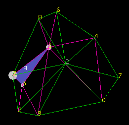

## Simplicial Interpolation

This software lets you specify a correspondence between points
in two Euclidean spaces ℝ*d* and ℝ*e*,
to then smoothly interpolate between them.  For instance, this lets a gamepad's
two joysticks (four dimensions) control dozens or hundreds of parameters.

It implements simplicial interpolation, as described in
[Interpolated Mappings for Musical Instruments](http://camille-g.com/os02.pdf),
[Organised Sound 7(2):85‒96](http://doi.org/10.1017/S1355771802002029), © Cambridge U. Press.

The source code is licensed under the [MIT License](https://mit-license.org/).
It is © 2021 Camille Goudeseune,
except for code from Ken Clarkson's [hull.shar](http://www.netlib.org/voronoi/), which is © 1995 AT&T.

### How to build and run

On almost any Linux, or macOS 10.3+,
to run the interactive OpenGL demo, type `make`.  
On Windows 10:
- Install [Windows Subsystem for Linux](https://docs.microsoft.com/en-us/windows/wsl/install-win10), using the [Ubuntu 20](https://www.microsoft.com/store/apps/9n6svws3rx71) distro.  
- Therein, `sudo apt install libgl-dev libgul1-mesa-dev freegut3-dev`
- `make`
- To run, also install an X server such as [VcXsrv](https://sourceforge.net/projects/vcxsrv/).

### How to operate

*Wave the mouse over the window.  If you like, click and drag even beyond the window.*

The mouse pointer `q` (for "query") is interpreted as a weighted sum
of the corners of its surrounding triangle.
The size of each point's gray disc shows its weight.
The special center point `C` is used for an unbounded simplex
(a triangle with one edge at infinity) when `q` lies outside the points' convex hull.

*Hit q or the escape key to exit.*

### How to customize

Start at the bottom of [si.c++](./si.c++).
For the OpenGL demo, call `evalInteractive()`;  alternatively,
to exercise the interpolator on randomly generated data, call `evalAutomatic()`.

### History

This was published in 2002 at [http://zx81.isl.uiuc.edu/interpolation/](http://web.archive.org/web/20021003120921/http://zx81.isl.uiuc.edu/interpolation/) (defunct), revised slightly in 2009, and moved to GitHub in 2018.
